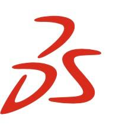

  <h3 style="margin: 0 0 30px;"><b>Appreciating the world, creating the future!</b></h3>

<h5>Pupil of 8th grade, State Educational Institution "Gymnasium N13", Minsk city</h5>
<h5>Programmer</h5>
<h5>Backend and Frontend (<i>programming languages: Python and C++</i>)</h5>
<h5>Middle RPA</h5>
<h5>Solidworks</h5>
<h5>Robotics</h5>

  <h3 style="margin: 30px 0 30px;"><b>IT-PRODUCT DEVELOPMENT</b></h3>

<h5>WEB-development, Frontend-development, Backend-development, RPA-development (PIX, PRIMO, Sherpa, UiPath), Artificial Intelligence, Development of IT products for educational purposes</h5>

  <h3 style="margin: 30px 0 30px;"><b>ROBOTECHNICS</b></h3>

<h5>Development of industrial robotics, Development of rehabilitation robotics, Development of 
educational robotics</h5>

  <h3 style="margin: 30px 0 30px;"><b>3D</b></h3>

<h5>3D modelling, 3D prototyping, 3D printing</h5>

    <h3 class="fw-bold">Education</h3>
    

      

        

          

          

              

                

                  
                

                
2024

                
++C

                
Academy of Informatics at BSUIR (Belarusian State University of Informatics and Radioelectronics)

              

            

            

              

                

                  
                

                
2024

                
Data Science

                
BELHARD Academy

              

            
        
            

              

                

                  
                

                
2024

                
SolidWorks

              

            

            

              

                

                  
                

                
2023

                
Data Science

                
BELHARD Academy

              

            

            

              

                

                  
                

                
2023

                
Python internship

                
BELHARD Academy

              

            

            

              

                

                  
                

                
2023

                
Python

                
BELHARD Academy

              

            

            

              

                

                  
                

                
2023

                
RPA (PIX, Sherpa, Primo, UiPath)

                
NARPA  (National Academy of Robotics and Process Automation, Russia)

              

            

            

              

                

                  
                

                
2023

                
++C

                
Academy of Informatics at BSUIR (Belarusian State University of Informatics and Radioelectronics)

              

            

            

              

                

                  
                

                
2023

                
Cybersecurity

                
Academy of Informatics at BSUIR (Belarusian State University of Informatics and Radioelectronics)

              

            

            

              

                

                  
                

                
2022

                
Java

                
Academy of Informatics at BSUIR (Belarusian State University of Informatics and Radioelectronics)

              

            

            

              

                

                  
                

                
2022

                
Python

                
Academy of Informatics at BSUIR (Belarusian State University of Informatics and Radioelectronics)

              

            

            

              

                

                  
                

                
2022

                
Web - master

                
Academy of Informatics at BSUIR (Belarusian State University of Informatics and Radioelectronics)

              

            

            

              

                

                  
                

                
2019

                
Robotics

                
Iteen academy

              

            

          

        

      

    

  

Number of visits:

